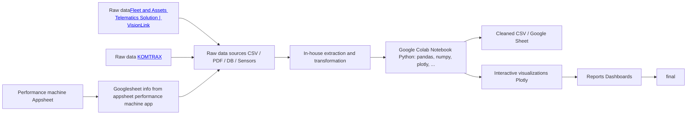
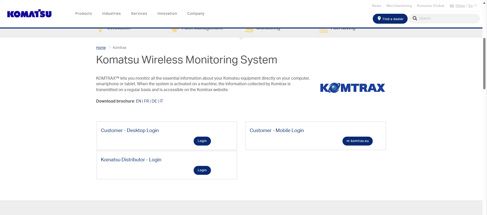
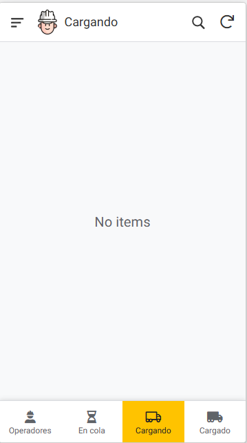
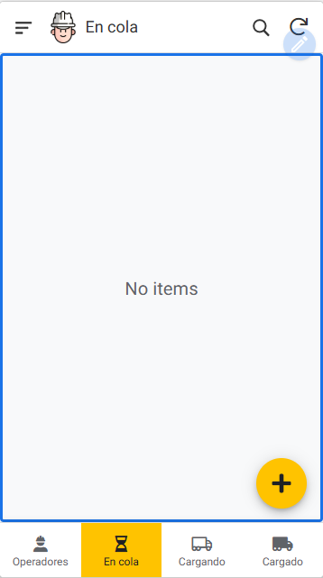
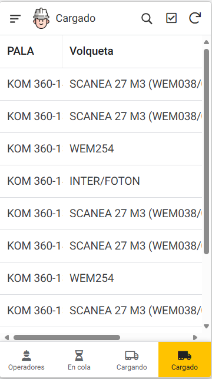
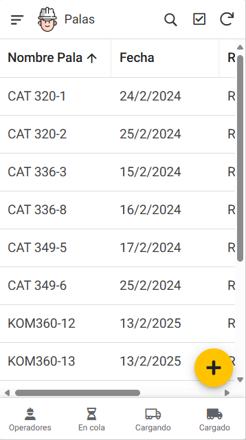

# ETL + AppSheet Project

## Overview

This repository contains an ETL pipeline and a small data product built with Google Colab and AppSheet. Input data was extracted and transformed using in-house tools, then processed in a Colab notebook using Python. The project produces cleaned CSV outputs, interactive Plotly visualizations, and a Google Sheet used as the backend for an AppSheet app.

## Highlights

- Input data: extracted and transformed with internal/in-house tooling before arriving to this repo.
- Processing environment: Google Colab (Python).
- Main libraries used: `pandas`, `numpy`, `plotly`, `matplotlib`, `seaborn`, `tabula-py` (for PDF extraction), `openpyxl` (Excel support), plus other common utilities.
- App: An AppSheet application was created to visualize and interact with the results (Google Sheets as backend).

## Project diagram



> The diagram shows the typical flow: raw sources are pre-processed with internal tools, then the Colab notebook performs final cleaning, feature calculation and visualization; results are saved to CSV or Google Sheets and optionally published as an AppSheet app.

## Tools for extracting information from external sources

- [Vision Link](https://vl.cat.com/es-ES) online application owned by **Caterpillar**, used to extract information from heavy machinery through GPS, including utilization, maintenance, and location data in CSV, JSON, and XLSX formats.  
-   
- [Komtrax](https://vl.cat.com/es-ES) "essential information about your Komatsu equipment directly on your computer, smartphone or tablet" in CSV, JSON, and XLSX formats.  
-   
- Rainfall history Excel file that tracks daily rainfall measured in millimeters per square meter of water.  
- Performance shovels app, an application developed with AppSheet, used to monitor the performance of mechanical shovels. As a backend database, Google Sheets is used.  

| View 1 | View 2 |
| - | - |
|  |  |
| View 3 | View 4 |
|  |  | 

### Demo AppSheet performance app


Request a copy at: jmesav@gmail.com

Examples of the extracted information can be found in `Data/input`

## Repository contents (example)

- `notebook_analysis.ipynb` — Main Google Colab notebook used for processing and visualization.
- `Data/` — Folder to store input and output CSVs.
- `Colab_tools/` — Helper scripts to extract information and clean from different formats (PDF, CSV, etc.).
- `docs/` — PNG, GIF, data
- `README.md` — This file.

## How it was built

1. Data ingestion: PDFs, CSVs and raw extracts were processed using internal ETL utilities (pre-processing done outside this repo). For PDFs `tabula-py` was used in some extraction flows.
2. Final cleaning and transformation: executed in Google Colab using Python. Key operations included parsing dates, filtering rows, renaming columns, calculating per-machine metrics, and unit conversions (e.g., liters → US gallons).
3. Analysis and visualization: Plotly (interactive charts) and Matplotlib/Seaborn (static plots) were used for exploratory analysis and final visuals.
4. App: results were exported to a Google Sheet and used as the backend for an AppSheet application designed for field data collection on mobile devices, with offline support.

## Quick start (Google Colab)

1. Open the `notebook_analysis.ipynb` file in Google Colab.
2. Ensure you have authorized access to Google Drive / Google Sheets if the notebook writes/reads from them. You can also download an example version of the app in this repository under `Data/output/`.
3. Run the cells top-down. Install missing packages at the top (examples below).

### Example pip installs (run in a Colab cell)

```python
!pip install pandas numpy plotly matplotlib seaborn scikit-learn tabula-py openpyxl
```

## Outputs

- Cleaned CSV files (per-machine time series, aggregated metrics).
- Interactive Plotly charts embedded in the Colab notebook.
- A Google Sheet used as AppSheet backend.

## Notes & best practices

- The initial extraction step is performed by internal tools; the notebook assumes a consistent schema after that stage.
- Use `git` to version-control the notebook and small helper scripts; **avoid pushing large raw data files** to the repository.
- When collaborating, prefer feature branches and Pull Requests to protect `main`.

## AppSheet

- An AppSheet application was created pointing to the produced Google Sheet. The app provides quick filtering, per-machine views and lightweight mobile access to key KPIs.

## License & contact

This project is provided without warranty. For questions or details about the internal extraction tools, contact me.

---

